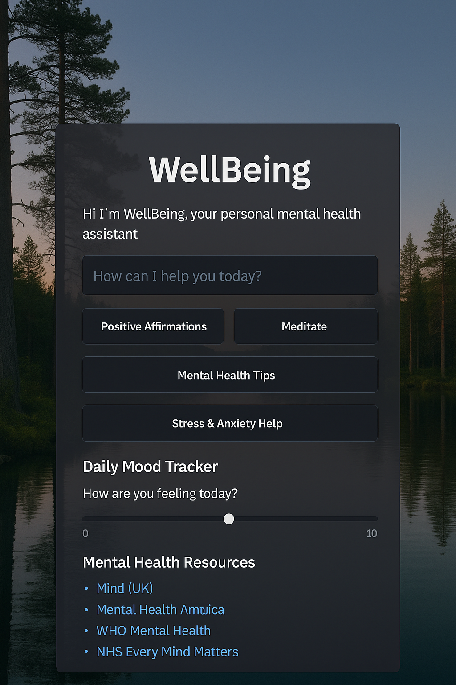

# WellBeing - Your Mental Health Chatbot Assistant

**WellBeing** is a Streamlit-powered chatbot app designed to provide mental wellness support, mindfulness tools, and helpful resources using a locally running LLM powered by Ollama.

It offers:
- Friendly mental health chatbot (LLM-based)
- Positive affirmations & guided meditations
- Mood tracking with visualization
- Curated mental health resources
- 100% local — no cloud or API calls

---

## Demo Screenshot

 

---

## Features

- AI conversation using **Ollama + LLaMA 3**
- Affirmations and meditation scripts
- Daily mood tracking with a graph
- Links to trusted mental health resources
- Sleek UI with a background image and dark overlay

---

## Installation and Launch Instructions

### Prerequisites
- Python 3.8 or higher installed on your system
- [Streamlit](https://streamlit.io/) installed (`pip install streamlit`)
- [Ollama](https://ollama.com/) installed and running locally with the LLaMA 3 model loaded

### Steps to Run the App

1. **Clone the repository**

```bash
git clone https://github.com/JoshuaJC-iitg/WellBeing-Streamlit-chatbot-project.git
cd WellBeing-Streamlit-chatbot-project
